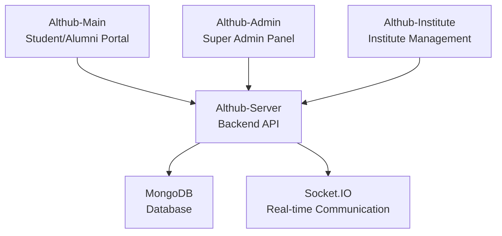

# Althub Student Connect

<div align="center">


**A comprehensive platform connecting alumni and students for mentorship, career guidance, and networking**

[](https://reactjs.org/)
[](https://nodejs.org/)
[](https://mongodb.com/)
[](https://socket.io/)

</div>

---

## Table of Contents

- [About](#about)
- [Key Features](#key-features)
- [Architecture](#architecture)
- [Technology Stack](#technology-stack)
- [Installation](#installation)
- [Project Structure](#project-structure)
- [API Documentation](#api-documentation)
- [Troubleshooting](#troubleshooting)
- [Contributing](#contributing)
- [License](#license)
- [Support](#support)

---

## About

**Althub Student Connect** is a comprehensive web application designed to bridge the gap between current students and alumni. The platform enables educational institutions to maintain strong connections with their graduates while providing students with access to valuable mentorship, career opportunities, and networking resources.

### Mission
> "We believe your Alumni should be at the Center"

In the value-focused reality that our alumni live in, we provide them a reason to give back their time, talent, & money by choosing the right technology and strategy.

---

## Key Features

### **For Students**
- **Alumni Directory**: Discover and connect with alumni from your institution
- **Mentorship Program**: Find mentors for career guidance and advice
- **Job Opportunities**: Access job postings and internship opportunities
- **Event Participation**: Join alumni events and networking sessions
- **Real-time Messaging**: Communicate directly with alumni and peers
- **Profile Management**: Showcase skills, projects, and achievements

### **For Alumni**
- **Student Mentoring**: Guide current students in their career paths
- **Job Posting**: Share opportunities from your company
- **Event Hosting**: Organize reunions and networking events
- **Knowledge Sharing**: Contribute to the content library
- **Networking**: Connect with fellow alumni and industry professionals

### **For Institutions**
- **User Management**: Comprehensive admin panel for managing users
- **Event Management**: Create and manage institutional events
- **Content Library**: Secure repository for educational materials
- **Analytics Dashboard**: Track engagement and platform usage
- **Financial Aid Management**: Manage scholarship and aid programs

### **Platform Features**
- **Real-time Communication**: Socket.IO powered messaging
- **Multi-role Authentication**: Secure login for students, alumni, and admins
- **Responsive Design**: Works seamlessly across all devices
- **File Upload**: Profile pictures and document sharing
- **Notification System**: Stay updated with platform activities
- **Search & Filter**: Advanced search capabilities

---

## Architecture

Althub Student Connect follows a **multi-platform architecture** with four main components:



### **Platform Components**

| Component | Purpose | Technology | Key Features |
|-----------|---------|------------|--------------|
| **Althub-Main** | Main student/alumni portal | React 18.2.0 | User profiles, posts, messaging, events, job search, alumni directory |
| **Althub-Admin** | Super admin management panel | React 17.0.2 | User management, institute management, system-wide analytics |
| **Althub-Institute** | Institute management interface | React 17.0.2 | Course management, event creation, student management, financial aid |
| **Althub-Server** | Backend API and real-time server | Node.js + Express | RESTful API, Socket.IO server, authentication, file uploads |

---

## Technology Stack

### **Frontend**
- **React** 18.2.0 - UI Framework
- **React Router** 6.10.0 - Client-side routing
- **Material-UI** 5.12.3 - Component library
- **Socket.IO Client** 4.6.1 - Real-time communication
- **Axios** 1.3.6 - HTTP client
- **React Toastify** 9.1.2 - Notifications

### **Backend**
- **Node.js** - Runtime environment
- **Express.js** 4.18.2 - Web framework
- **Socket.IO** 4.6.1 - Real-time communication
- **MongoDB** 7.0.3 - Database
- **Mongoose** 7.0.3 - ODM
- **JWT** 9.0.0 - Authentication
- **Bcryptjs** 2.4.3 - Password hashing

### **Additional Tools**
- **Multer** 1.4.5 - File upload handling
- **Nodemailer** 6.9.1 - Email services
- **CORS** 2.8.5 - Cross-origin resource sharing
- **Dotenv** 16.6.1 - Environment variables

---

## Installation

### Prerequisites
- **Node.js** (v14 or higher)
- **MongoDB** (v4.4 or higher)
- **npm** or **yarn**

### 1. Clone the Repository
```bash
git clone https://github.com/yourusername/althub-student-connect.git
cd althub-student-connect
```

### 2. Install Dependencies

#### Backend Server
```bash
cd Althub-Server
npm install
```

#### Main Portal
```bash
cd Althub-main
npm install
```

#### Admin Panel
```bash
cd Althub-admin
npm install
```

#### Institute Panel
```bash
cd Althub-Institute
npm install
```

### 3. Environment Setup

Create a `.env` file in the `Althub-Server` directory:

```env
PORT=5001
SOCKET_PORT=8900
MONGODB_URI=mongodb://localhost:27017/althub
JWT_SECRET=your_jwt_secret_key
EMAIL_USER=your_email@gmail.com
EMAIL_PASS=your_email_password
```

### 4. Database Setup
```bash
# Start MongoDB service
mongod

# The application will automatically create the database and collections
```

### 5. Run the Application

#### Start the Backend Server (Includes Socket.IO)
```bash
cd Althub-Server
npm start
```

**Note**: The server starts both the REST API on port 5001 and the Socket.IO server on port 8900 for real-time communication.

#### Start the Main Portal (Terminal 2)
```bash
cd Althub-main
npm start
```

#### Start the Admin Panel (Terminal 3)
```bash
cd Althub-admin
npm start
```

#### Start the Institute Panel (Terminal 4)
```bash
cd Althub-Institute
npm start
```

### 6. Access the Application

- **Main Portal**: http://localhost:3000
- **Admin Panel**: http://localhost:3001 (default React port, adjust if configured differently)
- **Institute Panel**: http://localhost:3002 (default React port, adjust if configured differently)
- **API Server**: http://localhost:5001
- **Socket.IO Server**: http://localhost:8900 (WebSocket connection)

---

## Project Structure

```
Althub-Student-Connect/
├── Althub-main/                 # Main student/alumni portal
│   ├── src/
│   │   ├── components/            # React components
│   │   ├── App.js                 # Main app component
│   │   └── baseURL.jsx           # API configuration
│   └── public/                    # Static assets
│
├── Althub-admin/               # Super admin panel
│   ├── src/
│   │   ├── jsx/
│   │   │   ├── pages/            # Admin pages
│   │   │   └── layout/           # Layout components
│   │   └── components/           # Reusable components
│   └── public/                   # Static assets
│
├── Althub-Institute/           # Institute management
│   ├── src/
│   │   ├── jsx/
│   │   │   ├── pages/            # Institute pages
│   │   │   └── layout/           # Layout components
│   │   └── components/           # Reusable components
│   └── public/                   # Static assets
│
├── Althub-Server/             # Backend API server
│   ├── controllers/              # Route controllers
│   ├── models/                   # Database models
│   ├── routes/                   # API routes
│   ├── middleware/               # Custom middleware
│   ├── config/                   # Configuration files
│   └── db/                       # Database connection
│
└── Documentation/             # Project documentation
    ├── Althub.pdf
    └── Althub_Doc2.pdf
```

---

## API Documentation

### Authentication & User Management
- `POST /api/register` - User registration
- `POST /api/login` - User login
- `POST /api/forgot-password` - Password reset request
- `POST /api/reset-password` - Password reset
- `GET /api/users` - Get all users
- `GET /api/users/:id` - Get user by ID
- `PUT /api/users/:id` - Update user profile
- `DELETE /api/users/:id` - Delete user
- `GET /api/search-user` - Search users by name or institute
- `PUT /api/follow/:id` - Follow/unfollow a user
- `GET /api/getFriendsPost/all` - Get posts from followed users

### Messaging & Conversations
- `GET /api/conversations` - Get user conversations
- `POST /api/conversations` - Create new conversation
- `GET /api/messages/:conversationId` - Get messages for a conversation
- `POST /api/messages` - Send a message

### Events
- `GET /api/events` - Get all events
- `POST /api/addEvent` - Create new event
- `PUT /api/editEvent` - Update event
- `DELETE /api/deleteEvent/:id` - Delete event
- `GET /api/getEventByInstitute/:instituteid` - Get events by institute

### Posts
- `GET /api/getPost` - Get all posts
- `POST /api/addPost` - Create new post (with image upload)
- `POST /api/editPost` - Update post
- `DELETE /api/deletePost/:id` - Delete post
- `PUT /api/like/:id` - Like/unlike a post
- `GET /api/getPostById/:userid` - Get posts by user ID
- `POST /api/instituteAddPost` - Institute creates a post

### Courses
- `GET /api/getCourse` - Get all courses
- `POST /api/addCourse` - Add new course
- `POST /api/editCourse` - Update course
- `DELETE /api/deleteCourse/:id` - Delete course
- `GET /api/getCourseByInstitute/:instituteid` - Get courses by institute

### Institute Management
- `GET /api/institutes` - Get all institutes
- `POST /api/registerInstitute` - Register new institute
- `POST /api/loginInstitute` - Institute login
- `PUT /api/updateInstitute/:id` - Update institute details
- `DELETE /api/deleteInstitute/:id` - Delete institute

### Company
- `GET /api/companies` - Get all companies
- `POST /api/addCompany` - Add new company
- `PUT /api/editCompany/:id` - Update company
- `DELETE /api/deleteCompany/:id` - Delete company

### Education & Experience
- `POST /api/addEducation` - Add education record
- `GET /api/getEducation/:userid` - Get user education
- `PUT /api/editEducation/:id` - Update education
- `DELETE /api/deleteEducation/:id` - Delete education
- `POST /api/addExperience` - Add experience record
- `GET /api/getExperience/:userid` - Get user experience
- `PUT /api/editExperience/:id` - Update experience
- `DELETE /api/deleteExperience/:id` - Delete experience

### Financial Aid
- `GET /api/financialaid` - Get all financial aid opportunities
- `POST /api/addFinancialAid` - Add financial aid
- `PUT /api/editFinancialAid/:id` - Update financial aid
- `DELETE /api/deleteFinancialAid/:id` - Delete financial aid

### Feedback
- `POST /api/addFeedback` - Submit feedback
- `GET /api/getFeedback` - Get all feedback

### Notifications
- `GET /api/notifications/:userId` - Get user notifications
- `POST /api/createNotification` - Create notification
- `PUT /api/readNotification/:id` - Mark notification as read

### Admin
- `POST /api/admin/login` - Admin login
- `GET /api/admin/users` - Get all users (admin)
- `GET /api/admin/institutes` - Get all institutes (admin)

### Socket.IO Real-time Events

The platform uses Socket.IO for real-time communication:

- **Connection**: Clients connect to `ws://localhost:8900`
- **`addUser`**: Register user for real-time updates (requires userId)
- **`getUsers`**: Receive list of online users
- **`sendMessage`**: Send real-time message to another user
- **`getMessage`**: Receive incoming message in real-time
- **`sendNotification`**: Send real-time notification to user
- **`getNotification`**: Receive notifications in real-time

**Example Client Connection**:
```javascript
import io from 'socket.io-client';
const socket = io('ws://localhost:8900');

socket.emit('addUser', userId);
socket.on('getUsers', (users) => {
  // Handle online users list
});
socket.on('getMessage', (data) => {
  // Handle incoming message
});
```

---

## Troubleshooting

### Common Issues

**MongoDB Connection Error**
- Ensure MongoDB is running: `mongod`
- Check the connection string in `.env` file
- Verify MongoDB is accessible on the default port 27017

**Port Already in Use**
- If port 3000, 3001, or 3002 is in use, React will automatically use the next available port
- If port 5001 or 8900 is in use, change it in the server configuration or `.env` file

**Socket.IO Connection Issues**
- Ensure the Socket.IO server (port 8900) is running
- Check CORS settings in `Althub-Server/index.js`
- Verify the client is connecting to the correct Socket.IO URL

**Module Not Found Errors**
- Run `npm install` in each project directory (Althub-Server, Althub-main, Althub-admin, Althub-Institute)
- Delete `node_modules` and `package-lock.json`, then reinstall if issues persist

**Authentication Issues**
- Verify JWT_SECRET is set in `.env` file
- Check cookie settings for cross-domain requests
- Ensure middleware is properly configured

**File Upload Issues**
- Ensure the `public` directory exists in `Althub-Server`
- Create necessary subdirectories: `public/postImages`, `public/eventImages`
- Check Multer configuration and file size limits

---

## Contributing

We welcome contributions to Althub Student Connect! Here's how you can help:

### 1. Fork the Repository
Fork the repository on GitHub by clicking the "Fork" button at the top right of the repository page.

### 2. Create a Feature Branch
```bash
git checkout -b feature/amazing-feature
```

### 3. Commit Your Changes
```bash
git commit -m 'Add some amazing feature'
```

### 4. Push to the Branch
```bash
git push origin feature/amazing-feature
```

### 5. Open a Pull Request

### Development Guidelines
- Follow the existing code style
- Write meaningful commit messages
- Add tests for new features
- Update documentation as needed
- Ensure all tests pass before submitting

---

## License

This project is licensed under the MIT License - see the [LICENSE](LICENSE) file for details.

---

## Support

If you have any questions or need help with the project:

- Email: althub.daiict@gmail.com
- Issues: [GitHub Issues](https://github.com/yourusername/althub-student-connect/issues)
- Documentation: [Project Wiki](https://github.com/yourusername/althub-student-connect/wiki)

---

<div align="center">

**Made with dedication for the education community**

[Star this repo](https://github.com/yourusername/althub-student-connect) | [Report Bug](https://github.com/yourusername/althub-student-connect/issues) | [Request Feature](https://github.com/yourusername/althub-student-connect/issues)

</div>