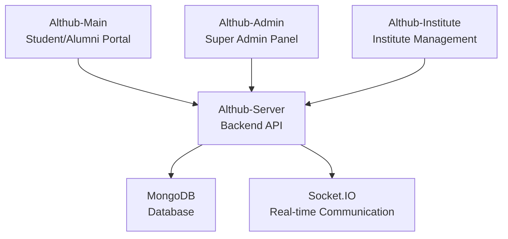

# Althub Student Connect

<div align="center">


**A comprehensive platform connecting alumni and students for mentorship, career guidance, and networking**

[](https://reactjs.org/)
[](https://nodejs.org/)
[](https://mongodb.com/)
[](https://socket.io/)

</div>

---

## Table of Contents

- [About](#about)
- [Key Features](#key-features)
- [Architecture](#architecture)
- [Technology Stack](#technology-stack)
- [Installation](#installation)
- [Project Structure](#project-structure)
- [API Documentation](#api-documentation)
- [Contributing](#contributing)
- [License](#license)

---

## About

**Althub Student Connect** is a comprehensive web application designed to bridge the gap between current students and alumni. The platform enables educational institutions to maintain strong connections with their graduates while providing students with access to valuable mentorship, career opportunities, and networking resources.

### Mission
> "We believe your Alumni should be at the Center"

In the value-focused reality that our alumni live in, we provide them a reason to give back their time, talent, & money by choosing the right technology and strategy.

---

## Key Features

### **For Students**
- **Alumni Directory**: Discover and connect with alumni from your institution
- **Mentorship Program**: Find mentors for career guidance and advice
- **Job Opportunities**: Access job postings and internship opportunities
- **Event Participation**: Join alumni events and networking sessions
- **Real-time Messaging**: Communicate directly with alumni and peers
- **Profile Management**: Showcase skills, projects, and achievements

### **For Alumni**
- **Student Mentoring**: Guide current students in their career paths
- **Job Posting**: Share opportunities from your company
- **Event Hosting**: Organize reunions and networking events
- **Knowledge Sharing**: Contribute to the content library
- **Networking**: Connect with fellow alumni and industry professionals

### **For Institutions**
- **User Management**: Comprehensive admin panel for managing users
- **Event Management**: Create and manage institutional events
- **Content Library**: Secure repository for educational materials
- **Analytics Dashboard**: Track engagement and platform usage
- **Financial Aid Management**: Manage scholarship and aid programs

### **Platform Features**
- **Real-time Communication**: Socket.IO powered messaging
- **Multi-role Authentication**: Secure login for students, alumni, and admins
- **Responsive Design**: Works seamlessly across all devices
- **File Upload**: Profile pictures and document sharing
- **Notification System**: Stay updated with platform activities
- **Search & Filter**: Advanced search capabilities

---

## Architecture

Althub Student Connect follows a **multi-platform architecture** with four main components:



### **Platform Components**

| Component | Purpose | Technology |
|-----------|---------|------------|
| **Althub-Main** | Main student/alumni portal | React 18.2.0 |
| **Althub-Admin** | Super admin management panel | React 17.0.2 |
| **Althub-Institute** | Institute management interface | React 17.0.2 |
| **Althub-Server** | Backend API and real-time server | Node.js + Express |

---

## Technology Stack

### **Frontend**
- **React** 18.2.0 - UI Framework
- **React Router** 6.10.0 - Client-side routing
- **Material-UI** 5.12.3 - Component library
- **Socket.IO Client** 4.6.1 - Real-time communication
- **Axios** 1.3.6 - HTTP client
- **React Toastify** 9.1.2 - Notifications

### **Backend**
- **Node.js** - Runtime environment
- **Express.js** 4.18.2 - Web framework
- **Socket.IO** 4.6.1 - Real-time communication
- **MongoDB** 7.0.3 - Database
- **Mongoose** 7.0.3 - ODM
- **JWT** 9.0.0 - Authentication
- **Bcryptjs** 2.4.3 - Password hashing

### **Additional Tools**
- **Multer** 1.4.5 - File upload handling
- **Nodemailer** 6.9.1 - Email services
- **CORS** 2.8.5 - Cross-origin resource sharing
- **Dotenv** 16.6.1 - Environment variables

---

## Installation

### Prerequisites
- **Node.js** (v14 or higher)
- **MongoDB** (v4.4 or higher)
- **npm** or **yarn**

### 1. Clone the Repository
```bash
git clone https://github.com/yourusername/althub-student-connect.git
cd althub-student-connect
```

### 2. Install Dependencies

#### Backend Server
```bash
cd Althub-Server
npm install
```

#### Main Portal
```bash
cd Althub-main
npm install
```

#### Admin Panel
```bash
cd Althub-admin
npm install
```

#### Institute Panel
```bash
cd Althub-Institute
npm install
```

### 3. Environment Setup

Create a `.env` file in the `Althub-Server` directory:

```env
PORT=8900
MONGODB_URI=mongodb://localhost:27017/althub
JWT_SECRET=your_jwt_secret_key
EMAIL_USER=your_email@gmail.com
EMAIL_PASS=your_email_password
```

### 4. Database Setup
```bash
# Start MongoDB service
mongod

# The application will automatically create the database and collections
```

### 5. Run the Application

#### Start the Backend Server
```bash
cd Althub-Server
npm start
```

#### Start the Main Portal (Terminal 2)
```bash
cd Althub-main
npm start
```

#### Start the Admin Panel (Terminal 3)
```bash
cd Althub-admin
npm start
```

#### Start the Institute Panel (Terminal 4)
```bash
cd Althub-Institute
npm start
```

### 6. Access the Application

- **Main Portal**: http://localhost:3000
- **Admin Panel**: http://localhost:3001
- **Institute Panel**: http://localhost:3002
- **API Server**: http://localhost:8900

---

## Project Structure

```
Althub-Student-Connect/
├── Althub-main/                 # Main student/alumni portal
│   ├── src/
│   │   ├── components/            # React components
│   │   ├── App.js                 # Main app component
│   │   └── baseURL.jsx           # API configuration
│   └── public/                    # Static assets
│
├── Althub-admin/               # Super admin panel
│   ├── src/
│   │   ├── jsx/
│   │   │   ├── pages/            # Admin pages
│   │   │   └── layout/           # Layout components
│   │   └── components/           # Reusable components
│   └── public/                   # Static assets
│
├── Althub-Institute/           # Institute management
│   ├── src/
│   │   ├── jsx/
│   │   │   ├── pages/            # Institute pages
│   │   │   └── layout/           # Layout components
│   │   └── components/           # Reusable components
│   └── public/                   # Static assets
│
├── Althub-Server/             # Backend API server
│   ├── controllers/              # Route controllers
│   ├── models/                   # Database models
│   ├── routes/                   # API routes
│   ├── middleware/               # Custom middleware
│   ├── config/                   # Configuration files
│   └── db/                       # Database connection
│
└── Documentation/             # Project documentation
    ├── Althub.pdf
    └── Althub_Doc2.pdf
```

---

## API Documentation

### Authentication Endpoints
- `POST /api/auth/register` - User registration
- `POST /api/auth/login` - User login
- `POST /api/auth/forgot-password` - Password reset request
- `POST /api/auth/reset-password` - Password reset

### User Management
- `GET /api/users` - Get all users
- `GET /api/users/:id` - Get user by ID
- `PUT /api/users/:id` - Update user profile
- `DELETE /api/users/:id` - Delete user

### Messaging
- `GET /api/messages/:conversationId` - Get messages
- `POST /api/messages` - Send message
- `GET /api/conversations` - Get user conversations

### Events
- `GET /api/events` - Get all events
- `POST /api/events` - Create event
- `PUT /api/events/:id` - Update event
- `DELETE /api/events/:id` - Delete event

---

## Contributing

We welcome contributions to Althub Student Connect! Here's how you can help:

### 1. Fork the Repository
```bash
git fork https://github.com/yourusername/althub-student-connect.git
```

### 2. Create a Feature Branch
```bash
git checkout -b feature/amazing-feature
```

### 3. Commit Your Changes
```bash
git commit -m 'Add some amazing feature'
```

### 4. Push to the Branch
```bash
git push origin feature/amazing-feature
```

### 5. Open a Pull Request

### Development Guidelines
- Follow the existing code style
- Write meaningful commit messages
- Add tests for new features
- Update documentation as needed
- Ensure all tests pass before submitting

---

## License

This project is licensed under the MIT License - see the [LICENSE](LICENSE) file for details.

---

## Support

If you have any questions or need help with the project:

- Email: althub.daiict@gmail.com
- Issues: [GitHub Issues](https://github.com/yourusername/althub-student-connect/issues)
- Documentation: [Project Wiki](https://github.com/yourusername/althub-student-connect/wiki)

---

<div align="center">

**Made for the education community**

[Star this repo](https://github.com/yourusername/althub-student-connect) | [Report Bug](https://github.com/yourusername/althub-student-connect/issues) | [Request Feature](https://github.com/yourusername/althub-student-connect/issues)

</div>